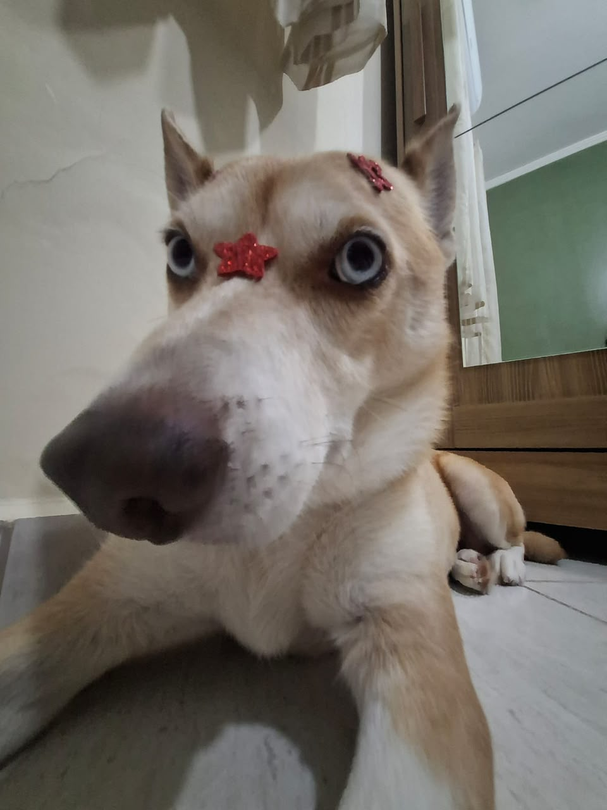
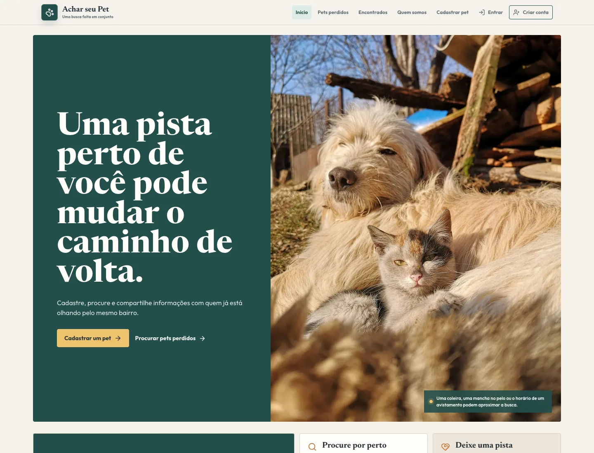
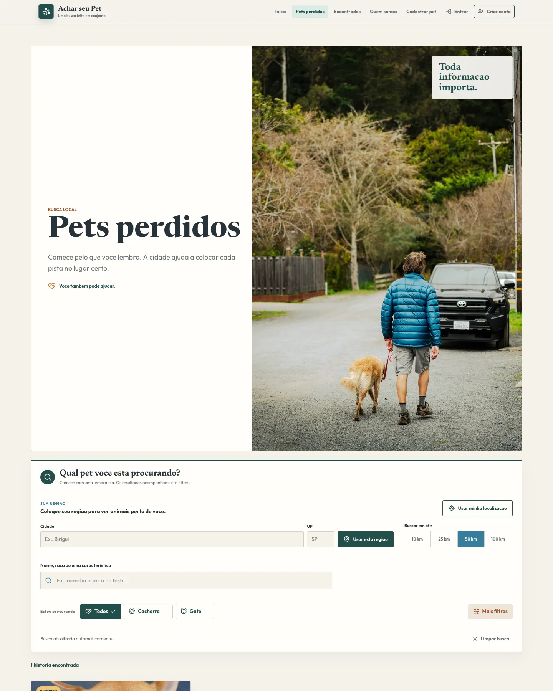
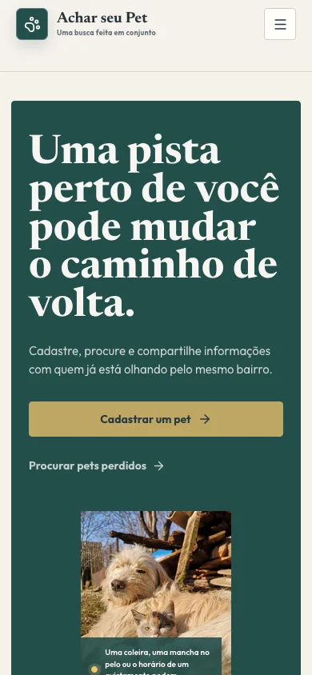
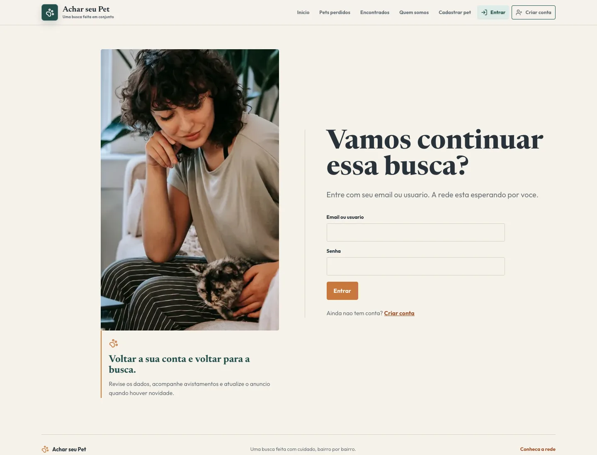

# Achar seu Pet

Aplicação web para ajudar famílias a divulgarem pets desaparecidos, encontrarem informações por região e registrarem avistamentos.

O projeto foi construído como uma aplicação separada de frontend e backend, com foco em uma experiência simples para quem procura um animal e em decisões técnicas demonstráveis em um portfólio.

## Problema

Quando um pet desaparece, as informações costumam ficar espalhadas em grupos e redes sociais. Isso dificulta encontrar anúncios, atualizar o status do animal e organizar pistas de pessoas que o viram.

## Motivação

Criei o Achar seu Pet a partir de uma experiência muito pessoal. Sempre tive
cachorros que, às vezes, fugiam de casa, e cada desaparecimento vinha
acompanhado do medo de alguém levá-los, de eles serem atropelados ou de eu não
conseguir encontrá-los.

Pensando nesse desespero e em outras pessoas que passam pela mesma situação,
desenvolvi uma plataforma para reunir informações, facilitar a divulgação e
transformar a ajuda da comunidade em uma busca mais organizada. A Lobinha,
minha própria cachorra e inspiração para o projeto, representa o motivo pelo
qual comecei.

<p align="center">
  
</p>

<p align="center"><em>Essa é a minha fujona. Ela se chama Lobinha.</em></p>

## Solução

O Achar seu Pet centraliza o cadastro, a busca e os avistamentos em um fluxo único:

- o responsável cadastra o pet com foto e características;
- outras pessoas filtram os anúncios por região e perfil;
- a página de detalhes exibe uma área aproximada no mapa;
- qualquer pessoa pode registrar um avistamento;
- a timeline organiza as pistas e mostra a proximidade estimada;
- o anúncio pode ser compartilhado pelo WhatsApp.

## Interface



<p align="center">
  
  
</p>



## Funcionalidades

- cadastro e login com JWT;
- renovação automática do access token sem repetir requisições entre sessões diferentes;
- cadastro, edição e exclusão de pets pelo autor;
- upload validado de imagens;
- filtros por status, estado, cidade, espécie, sexo, data e texto;
- geocoding de endereço por Nominatim/OpenStreetMap;
- mapa interativo com Leaflet;
- área aproximada para preservar a privacidade do endereço;
- registro de avistamentos com coordenadas e contato opcional;
- timeline de avistamentos em ordem decrescente;
- cálculo de distância por Haversine;
- indicador de avistamento próximo;
- compartilhamento dinâmico no WhatsApp;
- estados de carregamento, vazio, sucesso e erro;
- mensagens de erro para API offline, sessão expirada e falta de permissão;
- tratamento de exceções no React com Error Boundary;
- interface responsiva com identidade visual inspirada na Lobinha.

## Arquitetura

```text
React + Vite
      |
      | HTTP/JSON + multipart
      v
Django REST Framework
      |
      +-- JWT e permissões por autor
      +-- Geocoding Nominatim
      +-- Upload local de imagens
      v
SQLite local ou PostgreSQL em produção
```

Estrutura principal:

```text
backend/
  config/        configuração Django, URLs e WSGI
  pets/          models, API, regras geográficas e testes
  users/         cadastro, login JWT e usuário atual
frontend/
  src/pages/     telas da aplicação
  src/components componentes reutilizáveis
  src/services/  comunicação com a API
  src/context/   estado de autenticação
docs/            registro das fases e decisões técnicas
```

## Stack

### Frontend

- React 19;
- Vite;
- React Router;
- Axios;
- Leaflet e React Leaflet;
- Framer Motion;
- Lucide React;
- Oxlint;
- Vitest e Testing Library.

### Backend

- Python 3.12;
- Django 5.2 LTS;
- Django REST Framework;
- Simple JWT;
- Pillow;
- django-storages com backend S3;
- PostgreSQL via `DATABASE_URL`;
- Gunicorn para WSGI.

### Qualidade

- GitHub Actions para verificação automática de backend e frontend;
- testes Django/DRF;
- testes de componentes React e regras isoladas com `node:test`.

### Serviços planejados

- Neon para PostgreSQL;
- Render ou Railway para a API;
- Vercel para o frontend;
- Cloudflare R2 para imagens persistentes.

## Decisões técnicas

### Frontend e backend desacoplados

React cuida da experiência e Django oferece uma API REST independente. Isso permite evoluir as duas camadas separadamente e demonstra uma arquitetura comum em produtos web.

### Privacidade da localização

O endereço completo não é exibido publicamente. O mapa mostra apenas cidade, estado e um círculo de área aproximada usando as coordenadas do cadastro.

### Proximidade sem dependência de PostGIS

A primeira versão usa Haversine para calcular distâncias entre o desaparecimento e um avistamento. A abordagem é suficiente para o MVP e pode evoluir para PostGIS quando houver necessidade de escala.

### Upload validado

O backend valida extensão, tipo MIME e tamanho da imagem. Em desenvolvimento,
os arquivos ficam no disco local. Em produção, o projeto usa Cloudflare R2 por
meio da API compatível com S3, evitando perder uploads quando o servidor for
reiniciado ou substituído.

### Falhas visíveis

A interface diferencia carregamento, estado vazio, erro e sucesso. Erros técnicos continuam no console durante o desenvolvimento, enquanto a pessoa recebe uma mensagem compreensível.

## Rodar localmente

### Backend

```bash
cd backend
python -m venv .venv
source .venv/bin/activate
pip install -r requirements.txt
cp .env.example .env
python manage.py migrate
python manage.py runserver 127.0.0.1:8000
```

### Frontend

Em outro terminal:

```bash
cd frontend
npm install
cp .env.example .env
npm run dev -- --host 127.0.0.1 --port 5173
```

Se a porta `5173` estiver ocupada, o Vite pode usar `5174`. Essa origem já está prevista na configuração local do backend.

URLs locais:

- frontend: `http://127.0.0.1:5173` ou `http://127.0.0.1:5174`;
- API: `http://127.0.0.1:8000/api`.

### Dados de demonstração

Para visualizar a busca com pets fictícios, execute depois das migrations:

```bash
cd backend
.venv/bin/python manage.py seed_demo_pets
```

O comando pode ser executado novamente sem duplicar os registros. Os pets e
as localizações são dados de demonstração e não representam casos reais.

## Variáveis de ambiente

O projeto usa arquivos `.env` locais, que não devem ser versionados:

### Backend

```env
SECRET_KEY=uma-chave-secreta
DEBUG=True
DATABASE_URL=sqlite:///db.sqlite3
ALLOWED_HOSTS=localhost,127.0.0.1
CORS_ALLOWED_ORIGINS=http://localhost:5173,http://127.0.0.1:5173
GEOCODING_ENABLED=True
ADDRESS_SUGGESTION_URL=https://photon.komoot.io/api/
NOMINATIM_USER_AGENT=nome-do-projeto-e-contato
GEOCODING_CACHE_SECONDS=604800
NOMINATIM_MIN_INTERVAL_SECONDS=1
MEDIA_STORAGE_BACKEND=local
```

O acesso ao Nominatim público usa cache e respeita o intervalo mínimo global de
uma requisição por segundo em cada processo. Em produção, configure um
`NOMINATIM_USER_AGENT` que identifique o projeto e forneça um contato válido.
Para tráfego maior ou múltiplos processos, use um provedor de geocodificação
com SLA ou uma instância própria.

### Frontend

```env
VITE_API_URL=http://127.0.0.1:8000/api
```

Nunca coloque senhas, tokens ou chaves reais no README, no frontend ou no repositório.

## Testes e qualidade

Backend:

```bash
cd backend
.venv/bin/python manage.py check
.venv/bin/python manage.py makemigrations --check
.venv/bin/python manage.py test
```

Frontend:

```bash
cd frontend
npm test
npm run test:auth
npm run test:location
npm run lint
npm run build
```

Atualmente existem 68 testes backend e 31 testes frontend. A cobertura inclui autenticação, renovação JWT e sincronização entre abas, rotas protegidas, autocomplete de endereço, integridade e privacidade de coordenadas, criação de pet, upload, configuração de storage, permissões, filtros, avistamentos e cálculo de proximidade.

O workflow em `.github/workflows/ci.yml` repete essas verificações automaticamente em pushes e pull requests direcionados a `main`.

## Documentação complementar

- [Créditos das fotografias](CREDITS.md);
- [Identidade visual da Lobinha](docs/identidade-lobinha.md);
- [Upload de imagens](docs/upload-imagens-fase-14.md);
- [Geocoding](docs/geocoding-fase-15.md);
- [Mapa com Leaflet](docs/mapa-leaflet-fase-16.md);
- [Avistamentos](docs/avistamentos-fase-17.md);
- [Busca por proximidade](docs/proximidade-fase-20.md);
- [Tratamento de erros e UX](docs/erros-ux-fase-22.md);
- [Segurança](docs/seguranca-fase-23.md);
- [Testes automatizados](docs/testes-automatizados-fase-24.md).

## Status do portfólio

Este projeto foi preparado como uma demonstração de portfólio e não está publicado como aplicação em produção. O repositório apresenta a arquitetura, as decisões técnicas, os testes e os principais fluxos do Achar seu Pet.

O suporte a armazenamento persistente com Cloudflare R2 está implementado para um futuro deploy. A publicação da aplicação depende da configuração de hospedagem, banco PostgreSQL, bucket R2 e credenciais de produção.

## Licença

O código deste projeto está disponível sob a [licença MIT](LICENSE). As
fotografias seguem as condições e os créditos descritos em [CREDITS.md](CREDITS.md).

## Próximos passos

- testar manualmente todos os fluxos com calma;
- se desejado, adicionar um vídeo curto da navegação;
- publicar o repositório depois da revisão final.
